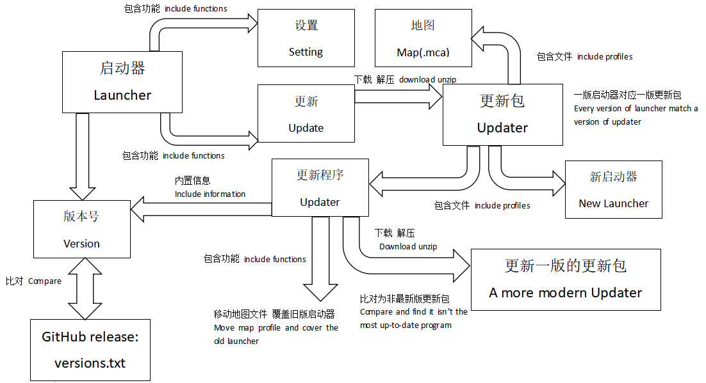

## 关于启动器功能实现的简要描述

## Simple Description of the launcher

上图描述了启动器的主要功能实现：通过设置启动代码(.bat)启动MCI,通过与发表在Github的文本比对是否为最新版。不难发现,主要难点在于更新功能的实现。

简单来说,我们在启动器中内置了四个Text控件存放版本信息,通过下载Github上的versions.txt比对,若存在更新,则根据每一版启动器对应的url下载更新包(需要注意的是, 每个版本的更新url是写死在启动器中的)。

当更新程序检测到跨版本更新,即,更新包版本不是最新版,则下载对应的更新的更新包,直到确认为最新版,再覆盖启动器。

The figure above describes the main functions of the initiator: Start MCI by setting the startup code (. bat), and check whether it is the latest version by comparing it with the text published in GitHub. It is not difficult to find that the main difficulty lies in the implementation of the update function.

To put it simply, we have built four Text controls in the launcher to store version information. By downloading the versions.txt comparison on Github, if there is an update, we will download the update package according to the corresponding url of each version of the launcher (it should be noted that the update url of each version is directly written in the launcher).

When the updater detects cross version updates, that is, the update package version is not the latest version, download the corresponding more modern update package until it is confirmed to be the latest version, and then overwrite the initiator
